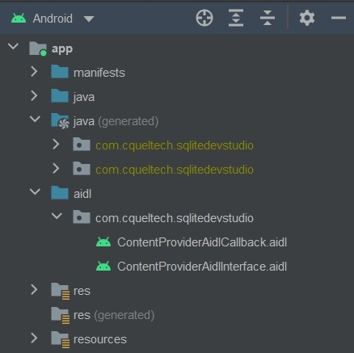

# SQLiteContentProvider

SQLiteContentProvider.java manages access to an App's central repository of data, in this case a SQLite database(s). The primary use of a Content Provider is to allow data access from one application to another application. It is essentially a conduit for manipulating a database from a different application to the one that is currently in use.

SQLiteContentProvider.java is a customized Content Provider intended for use by the SQLiteDevStudio App which can be downloaded from the GooglePlay Library. SQLiteDevStudio is a SQLite Database management and development tool. It can be used to view, maintain and build SQLite databases as well as manipulate data.

## Installation

Installation of the content provider into your own app has a few simple steps:

1. To operate, the content provider has it's 'exported' attribute set to 'true' so we need to incorporate a level of security to prevent other/malicious apps from accessing your own app's databases via the new content provider. Create a 'secrets.xml' file in the project's '/res/values' folder. The resources shown below should be incorporated into the xml file using your own encryption key and provider access code.

            <resources>
                  <string name="provider_encryption_key">your_encryption_key</string> <!--Needs to be 16 characters-->
                  <string name="provider_access_code">your_provider_access_code</string>
            </resources>

2. When executing database operations during an open database transaction SQLiteDevStudio uses an AIDL Interface to communicate with a remote service embedded inside this Content Provider. It is this remote service that interacts with the targetted database ensuring that all database operations are processed using the same background thread. Failure to utilise the same thread during an open database transaction will result in a database locked exception. To setup the AIDL interface we need to create two .aidl files within your project.

      - ContentProviderAidlInterface.aidl
      - ContentProviderAidlCallback.aidl
      
      Both files can be found in this repository.
      The .aidl files should be placed in your projects directory structure as follows:-

      
      
      Now build the project. The Android SDK Tools will automatically generate an interface in Java based on the .aidl files.

3. Download the script SQLiteContentProvider.java and include the class in your own project. Replace the final string variable 'AUTHORITY' value with your own value (in internet domain ownership format) as the basis of your provider authority. For example, 'private static final String AUTHORITY = "com.abc.xyz";'. This is used to identify which content provider is being targeted.

4. Your app needs to be made aware of the new content provider and remote service, include the following provider and service tags in the Manifest file:
      
          ...
            <application>
              ...
              <provider
                  android:authorities="com.abc.xyz"
                  android:name=".SQLiteContentProvider"
                  android:grantUriPermissions="true"
                  android:exported="true"
                  android:protectionLevel="normal"
                  android:syncable="true"
                  android:process=":sqlitecontentprovider_remote_process"
                  tools:ignore="ExportedContentProvider" />
                  
              <service
                  android:name="SQLiteContentProvider$ContentProviderAidlService"
                  android:process=":sqlitedevstudio_service"
                  android:enabled="true"
                  android:exported="true"
                  tools:ignore="ExportedService">
                  <intent-filter>
                      <action android:name="ContentProviderAidlService" />
                  </intent-filter>
              </service>
              ...
          </application>
          ...

      The 'authorities' attribute should have the same value as you used for the AUTHORITY variable in step 3.
      
5. In Android R and higher we need to implement an intent filter in the manifest due to new Package Visibilty protocols. Include the following intent filter within your launcher activity.

          ...
          <activity
          ...>
              ...
              <intent-filter>
                  <action android:name="com.cqueltech.sqlitedevstudio.QUERY"/>
                  <category android:name="android.intent.category.DEFAULT"/>
              </intent-filter>
          </activity>
          ...
          
6. Now that the content provider has been applied to your own project access to your app's database(s) from SQLiteDevStudio can be achieved by creating an encrypted provider access code in SQLiteDevStudio. This is done via the following menu item: (menu-->Administration-->Provider Access Code). For the authority string that you used in step 3 enter an encryption key and provider access code. These should match the resource entries in the 'secrets.xml' file. The encryption key will be used to encrypt the provider access code. Only the encrypted access code will be stored in SQLiteDevStudio. Each time a request is made to the content provider the encrypted access code will be passed. Only a successfully decrypted access code matched against the corresponding secrets.xml resource will allow access to the content provider and your app's database(s).

## Contributing

Pull Requests are welcome. For major changes, please open an issue first to discuss what you would like to change.
